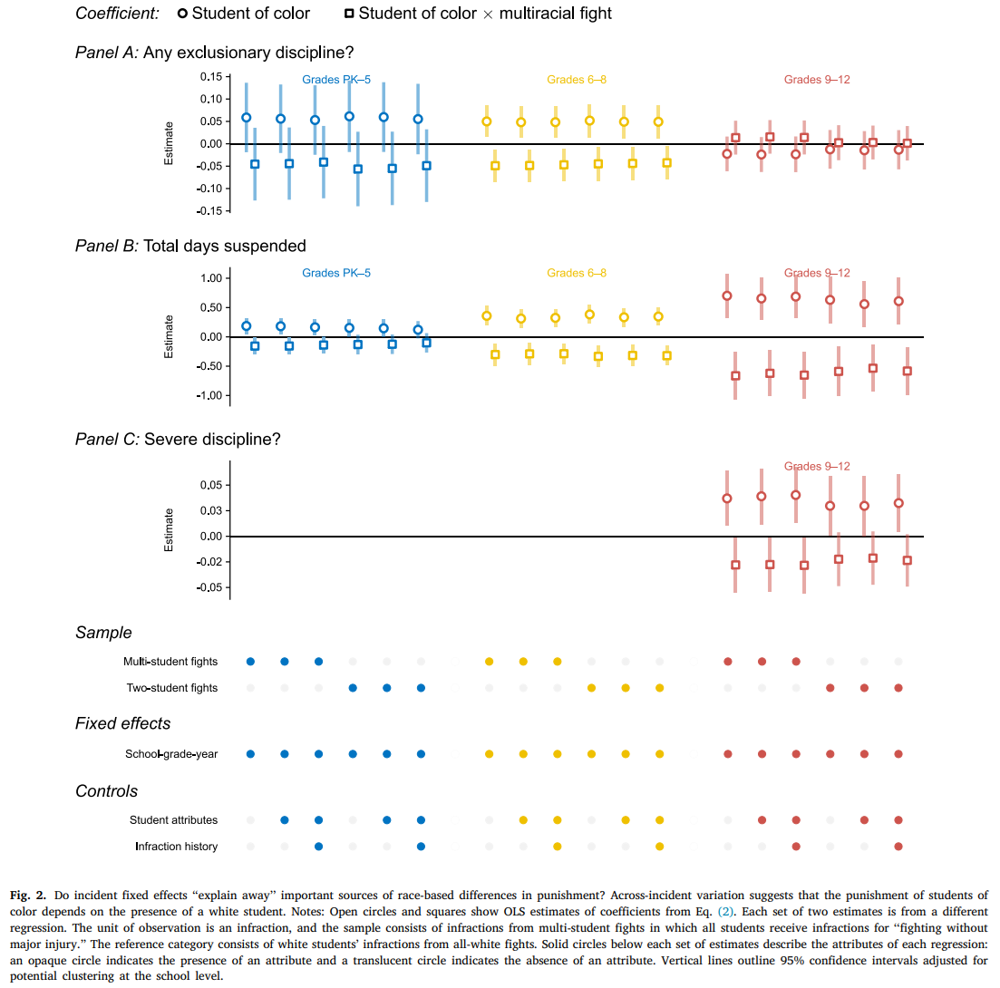
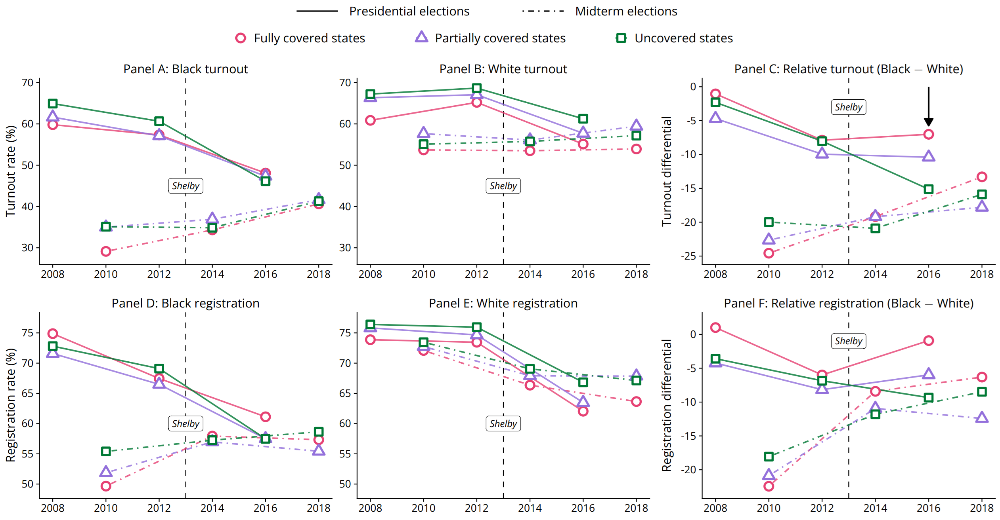

## Publications

::: {.callout-note}
**2024**, "[Does the Salience of Race Mitigate Gaps in Disciplinary Outcomes? Evidence from School Fights](files/RazeWaddell_Salience-of-Race_EER_2024.pdf)," *Economics of Education Review* (with Glen Waddell). 

::: {style="float: left; position: relative; top: 0px; padding: 0px 30px 0px 0px;"}
{.lightbox width="300"}
:::

Racial gaps in the adjudication of student misconduct are well documented---relative to white students engaged in similar behaviors, students of color are more likely to be disciplined and the discipline they receive tends to be harsher. We show that racial disparities in the adjudication of fighting infractions depend on the racial composition of incidents. While significant disparities exist within schools, we find little if any within-incident disparities. Examining disparities across fights, we show that students of color are punished more severely, on average, as fights involving only students of color are punished more severely than fights involving only white students. Moreover, students of color in multi-race fights receive punishments that are statistically indistinguishable from those assigned to white students in fights involving only white students, suggesting that disparities arise from the differential adjudication of incidents by their racial composition rather than from the differential adjudication of students within the same incident.

[ Manuscript](files/RazeWaddell_Salience-of-Race_EER_2024.pdf){.btn .btn-outline-success .btn-sm}
:::

::: {.callout-note}
**2022**, "[Voting Rights and the Resilience of Black Turnout](files/Raze_2022_EconInq_VotingRights.pdf)," *Economic Inquiry*.

::: {style="float: left; position: relative; top: 0px; padding: 0px 30px 0px 0px;"}
{.lightbox width="400"}
:::

The Voting Rights Act of 1965 increased turnout among Black voters, which then generated economic benefits for Black communities. In *Shelby County v. Holder* (2013), the Supreme Court invalidated the enforcement mechanism responsible for these improvements, prompting concerns that states with histories of discriminatory election practices would respond by suppressing Black turnout. I estimate the effect of the *Shelby* decision on the racial composition of the electorate using triple-difference comparisons of validated turnout data from the Cooperative Congressional Election Study. The data suggest that the *Shelby* decision did not widen the Black-white turnout gap in states subject to the ruling.

[ Manuscript](files/Raze_2022_EconInq_VotingRights.pdf){.btn .btn-outline-success .btn-sm} [ Appendix](files/Raze_2022_EconInq_VotingRights_appendix.pdf){.btn .btn-outline-success .btn-sm} [ Code](https://github.com/kyleraze/shelby_county_voting_replication){.btn .btn-outline-success .btn-sm} [ *CNN*](https://www.cnn.com/2021/03/28/politics/voting-rights-georgia-souls-polls-blake/index.html){.btn .btn-outline-success .btn-sm} [ *The New York Times* (1)](https://www.nytimes.com/2021/03/16/opinion/voting-republicans-democrats.html){.btn .btn-outline-success .btn-sm} [ *The New York Times* (2)](https://www.nytimes.com/2021/03/31/opinion/house-senate-2022-2024.html){.btn .btn-outline-success .btn-sm}
:::

## Working papers

::: {.callout-note}
**2026**, "[Employment and Earnings Trajectories of HUD Program Participants](https://www.census.gov/library/working-papers/2026/adrm/CES-WP-26-31.html)," *Center for Economic Studies Working Paper No. 26-31* (with Rachel Shattuck, David Pritchard, Brad Foster, Sonya Porter, Denise Flanagan-Doyle, Veronica Garrison, Jacqueline Bachand, and Ethan Krohn). 

Federal housing assistance programs, such as those run by the U.S. Department of Housing and Urban Development (HUD), have been shown to reduce rent burden and improve housing stability for program participants, which may in turn have downstream impacts on their labor market attachment and career trajectories. However, existing studies from individual cities or states provide mixed evidence on the association of housing assistance with labor market outcomes. By linking HUD administrative records to matched employee-employer earnings records from the Longitudinal Employer-Household Dynamics (LEHD) program, we document how the labor market trajectories of program participants change as they enter and exit federal housing assistance programs, examining outcomes over a 14-year window surrounding entry or exit. In our analysis of entry, we find that the employment rates and earnings of first-time HUD program participants begin to increase upon entering a HUD program, which represents a reversal of prior declining trends in these outcomes. Suggestive of a positive association, these increases in employment and earnings trends exceed those of low-income non-participants from the American Community Survey (ACS). In our analysis of exits, we find that program participants who eventually leave a HUD program have increasing pre-exit trends in employment and earnings that then flatten upon exiting. Comparing these negative changes in trend to the relatively stable trajectories of those who remain in HUD programs throughout the analysis suggests that exits are associated with diminished employment and earnings trajectories.

[ Manuscript](https://www2.census.gov/library/working-papers/2026/adrm/ces/CES-WP-26-31.pdf){.btn .btn-outline-success .btn-sm}
:::

::: {.callout-note}
**2026**, "[Non-Random Assignment of Individual Identifiers and Selection into Linked Data: Implications for Research](https://www.census.gov/library/working-papers/2026/adrm/CES-WP-26-06.html)," *Center for Economic Studies Working Paper No. 26-06* (with Nicole Perales and Christin Landivar). 

The U.S. Census Bureau’s Person Identification Validation System facilitates anonymous linkages between survey and administrative records by assigning Protected Identification Keys (PIKs) to person records. While PIK assignment is generally accurate, some person records are not successfully assigned a PIK, which can lead to sample selection bias in analyses of linked data. Using the American Community Survey (ACS) and the Current Population Survey Annual Social and Economic Supplement (CPS ASEC) between 2005 and 2022, we corroborate and extend existing findings on the drivers of PIK assignment, showing that the rate of PIK assignment varies widely across socio-demographic subgroups. Using earnings as a test case, we then show that limiting a survey sample of wage earners to person records with PIKs or successful linkages to W-2 wage records tends to overestimate self-reported wage earnings, on average, indicative of linkage-induced selection bias. In a validation exercise, we demonstrate that reweighting methods, such as inverse probability weighting or entropy balancing, can mitigate this bias. 

[ Manuscript](files/RazePeralesLandivar_2026_CES_SelectionLinkedData.pdf){.btn .btn-outline-success .btn-sm}
:::